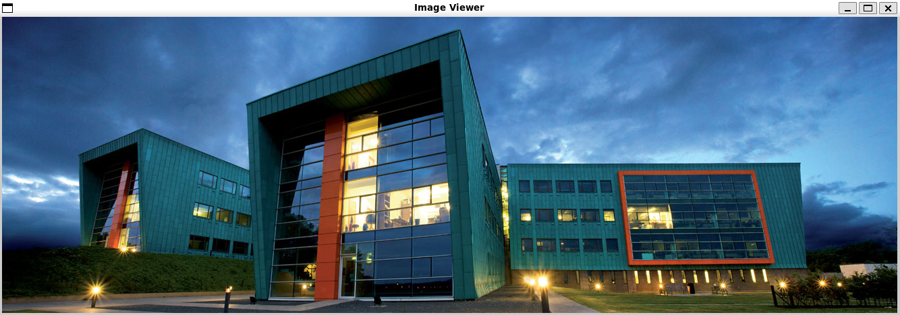
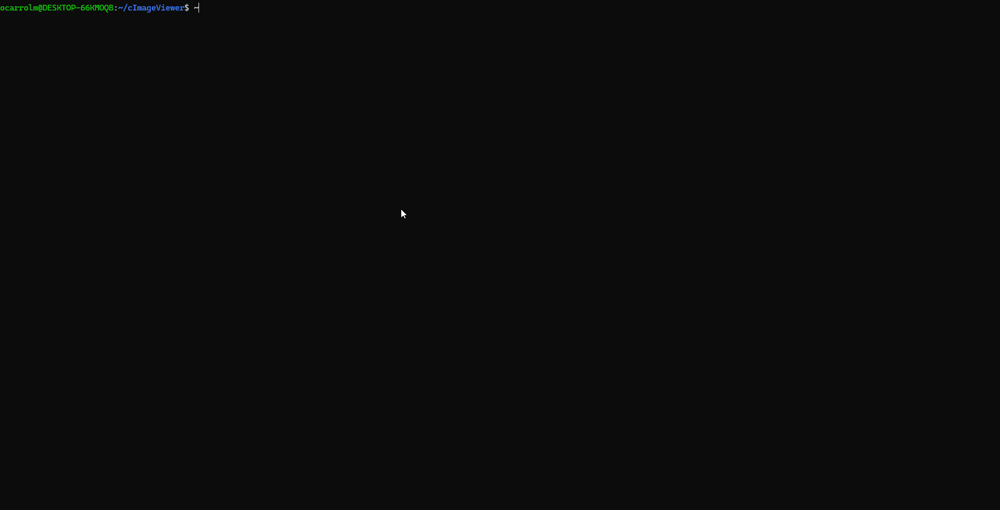

<div align="center">

# PPM C Image Viewer

**A lightweight PPM image viewer written in C using SDL2**

[](https://en.wikipedia.org/wiki/C_(programming_language))
[](https://www.libsdl.org/)
[](LICENSE)

<!-- 📸 SCREENSHOT: Add a screenshot of your viewer displaying an image -->
<!--  -->



*Reads raw PPM files from stdin and renders them in a native window.*


</div>

## ✨ Features

- Renders P6 (binary) PPM images
- Dynamic window sizing based on image dimensions
- Minimal dependencies — just SDL2
- Reads from stdin for easy piping

<div align="center">

## 🎬 Demo



*Run the viewer and pipe in any PPM file*

</div>

<div align="center">

</div>


## 📦 Requirements

- GCC or Clang
- SDL2 development libraries

### Installing SDL2

| Platform | Command |
|:--------:|:--------|
| Ubuntu/Debian | `sudo apt install libsdl2-dev` |
| Fedora | `sudo dnf install SDL2-devel` |
| macOS | `brew install sdl2` |

---

## 🔨 Building

```bash
gcc -o viewer viewer.c -lSDL2
```

---

## 🚀 Usage

Pipe a PPM file into the viewer:

```bash
./viewer < image.ppm
```

Or use it in a pipeline:

```bash
cat image.ppm | ./viewer
```

Close the window to exit.

---

<div align="center">

## 🖼️ Example Renders

<!-- Add example images in a row -->
<!--  &nbsp;
 &nbsp;
 -->

*Generate test images with ImageMagick:*

</div>

```bash
# Solid color
convert -size 200x200 xc:red ppm:test.ppm

# Gradient
convert -size 400x300 gradient:blue-yellow ppm:gradient.ppm

# From any image
convert your_photo.jpg output.ppm
```

---

<div align="center">

## ⚙️ How It Works

</div>

```
┌─────────────┐     ┌──────────────┐     ┌─────────────┐     ┌──────────────┐
│   stdin     │ ──▶ │ Parse Header │ ──▶│ Read Pixels │ ──▶│  SDL Window  │
│  (PPM file) │     │ (dimensions) │     │ (RGB data)  │     │  (render)    │
└─────────────┘     └──────────────┘     └─────────────┘     └──────────────┘
```

The viewer expects **P6 (binary) format** PPM files:

```
P6
# optional comment
width height
max_color_value
[binary RGB data]
```

---

<div align="center">

## 📚 PPM Format Reference

</div>

| Component | Description |
|:---------:|:------------|
| Magic number | `P6` for binary PPM |
| Dimensions | `width height` as ASCII integers |
| Max value | Usually `255` |
| Pixel data | Raw bytes: R, G, B, R, G, B, ... |

---

<div align="center">

*Built as a learning project exploring low-level graphics and file format parsing in C.*

</div>